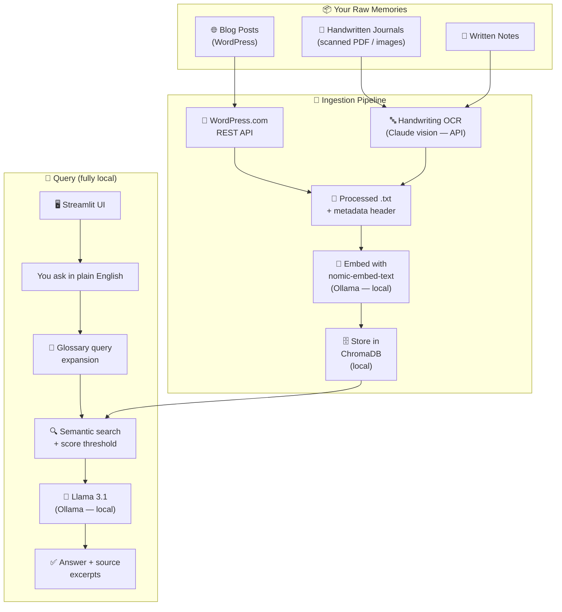

# Along the Memory Lane 📖

A fully local, private AI assistant for querying years of personal journals, blogs, and notes.
**The goal is that nothing leaves your machine.** Today one step — handwriting OCR — is
temporarily running through Claude vision while the local pipeline is being tuned; it is
slated to move to local llama3.2-vision (see [Privacy](#privacy)).

→ See [VISION.md](./VISION.md) for the story behind this project.

---

## Architecture



---

## Quick Start

### Prerequisites
- macOS (Apple Silicon) or Linux
- Python 3.11+ — [uv](https://docs.astral.sh/uv/) recommended
- [Ollama](https://ollama.com) for local embeddings + chat
- An [Anthropic API key](https://console.anthropic.com) — only needed to OCR handwritten journals

### 1. Install Ollama and pull the local models
```bash
brew install ollama
ollama serve          # keep running in the background
ollama pull llama3.1
ollama pull nomic-embed-text
```

### 2. Set up the Python environment
```bash
git clone https://github.com/praveenkottayi/along-the-memory-lane.git
cd along-the-memory-lane
uv sync                       # or: python -m venv .venv && pip install -r requirements.txt
```

### 3. Configure secrets and your glossary
```bash
cp .env.example .env          # add ANTHROPIC_API_KEY (only used for journal OCR)
cp glossary.example.txt glossary.txt   # add your names/abbreviations
```
The glossary is the single source of truth for personal shorthand. It feeds both
the LLM system prompt and **query expansion** — so a search for "Anu" is rewritten
to "Anu (wife)" before retrieval and actually finds the right entries.

### 4. Ingest your memories

**Blog (WordPress.com):**
```bash
python scripts/fetch_wordpress_api.py --site yoursite.com   # posts + images
# Alternative, from a local XML export:
# python scripts/parse_wordpress.py --input data/raw/blog/wordpress_export.xml
python scripts/ingest.py
```

**Handwritten journals** — two ways to transcribe:
```bash
# A) Automated: PDF → images → Claude OCR (auto-detects date headers)
python scripts/pdf_to_images.py --pdf "data/raw/journal/#16_01_08_2025_15_01_2026.pdf"
python scripts/ocr_journals.py --journal data/raw/journal/16_2025-08_2026-01

# B) Manual: transcribe in a Claude chat into one .txt with PAGE markers, then split
python scripts/split_journal_txt.py --input data/processed/journal/_16.txt

python scripts/ingest.py --incremental   # add only the new journal entries
```

### 5. Run the app
```bash
streamlit run app/app.py
```

---

## Project Structure

```
along-the-memory-lane/
├── VISION.md                   ← Project intention (start here)
├── README.md                   ← Technical setup (you are here)
├── config.py                   ← All paths, models, prompt + glossary loading
├── pyproject.toml / uv.lock    ← Dependencies (requirements.txt mirrors these)
├── .env.example                ← Template for ANTHROPIC_API_KEY
├── glossary.example.txt        ← Template for personal names/abbreviations
│
├── data/                       ← gitignored — your personal content
│   ├── raw/journal|blog|notes/ ← scanned PDFs/images, WordPress export
│   └── processed/              ← parsed .txt files with metadata headers
│
├── memory_store/               ← ChromaDB vector index (gitignored)
│
├── scripts/
│   ├── common.py               ← shared slug / HTML / front-matter helpers
│   ├── fetch_wordpress_api.py  ← fetch posts + images from a live WordPress.com site
│   ├── parse_wordpress.py      ← alternative: parse a local WordPress XML export
│   ├── pdf_to_images.py        ← scanned journal PDF → page images
│   ├── ocr_journals.py         ← Claude-vision OCR of journal images → entries
│   ├── split_journal_txt.py    ← split a pasted Claude transcription into entries
│   └── ingest.py               ← chunk + embed + store in ChromaDB
│
└── app/
    └── app.py                  ← Streamlit query UI
```

---

## Phases

| Phase | Description | Status |
|-------|-------------|--------|
| 1 | WordPress blog ingestion + local RAG query UI | ✅ Complete |
| 2 | Handwritten journal OCR (PDF → Claude vision → entries) | 🚧 In progress |
| 3 | Photo search — vision descriptions + CLIP visual embeddings via Qdrant | ⬜ Planned |
| 4 | "On This Day" feature + timeline browser | ⬜ Planned |

---

## Privacy

The goal is uncompromising: **nothing leaves your machine.**

**Fully local today — never leaves your machine:**
- Text embeddings and chat (Ollama: `nomic-embed-text` + `llama3.1`)
- The ChromaDB vector index in `memory_store/`
- Every query, retrieval, and generated answer
- `data/`, `memory_store/`, `.env`, and `glossary.txt` are gitignored

**Temporary exception — handwriting OCR:**
Local vision models tried so far (Apple Vision, llava, moondream, Tesseract,
llama3.2-vision) couldn't reliably read cursive, so while the RAG side is being
trialled, journal page **images** are transcribed via the Claude API. This is a
stopgap, not the destination — the plan is to move OCR back to local
llama3.2-vision once it reads the handwriting well. Even now it runs only when you
OCR journals, sends images only (never the index or your queries), and is skipped
entirely if you ingest only typed sources (blogs, notes).
