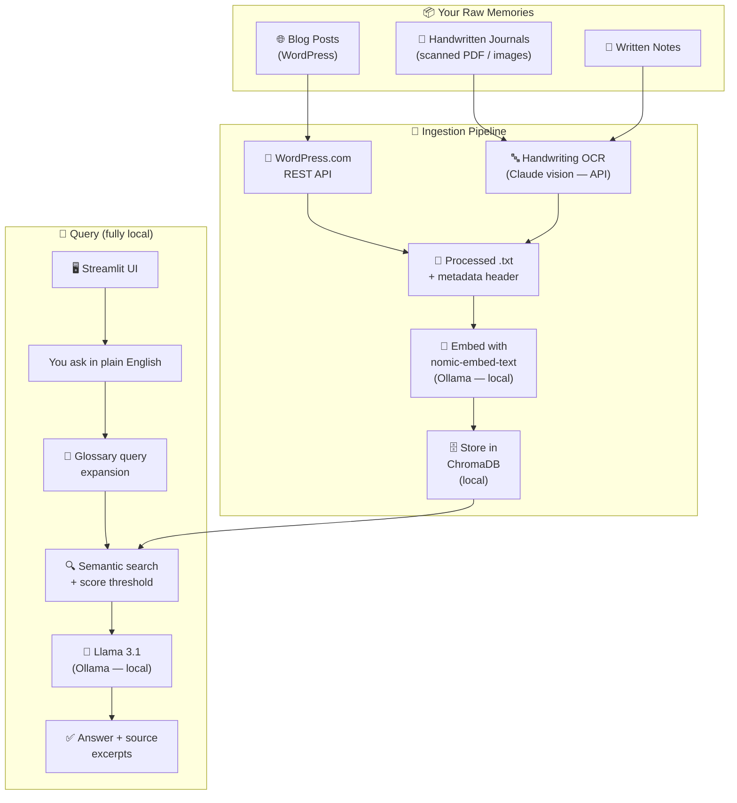

# Along the Memory Lane 📖

A fully local, private AI assistant for querying years of personal journals, blogs, and notes.
**The goal is that nothing leaves your machine.** Today one step — handwriting OCR — is
temporarily running through Claude vision while the local pipeline is being tuned; it is
slated to move to local llama3.2-vision (see [Privacy](#privacy)).

→ See [VISION.md](./VISION.md) for the story behind this project.

---

## Architecture



---

## Quick Start

### Prerequisites
- macOS (Apple Silicon) or Linux
- Python 3.11+ — [uv](https://docs.astral.sh/uv/) recommended
- [Ollama](https://ollama.com) for local embeddings + chat
- An [Anthropic API key](https://console.anthropic.com) — only needed to OCR handwritten journals

### 1. Install Ollama and pull the local models
```bash
brew install ollama
ollama serve          # keep running in the background
ollama pull llama3.1:8b-instruct-q4_0   # matches LLM_MODEL in config.py
ollama pull nomic-embed-text             # matches EMBED_MODEL in config.py
```

### 2. Set up the Python environment
```bash
git clone https://github.com/praveenkottayi/along-the-memory-lane.git
cd along-the-memory-lane
uv sync                       # or: python -m venv .venv && pip install -r requirements.txt
```

### 3. Configure secrets and your glossary
```bash
cp .env.example .env          # add ANTHROPIC_API_KEY (only used for journal OCR)
cp glossary.example.txt glossary.txt   # add your names/abbreviations
```
The glossary is the single source of truth for personal shorthand. It feeds both
the LLM system prompt and **query expansion** — so a search for "Anu" is rewritten
to "Anu (wife)" before retrieval and actually finds the right entries.

### 4. Ingest your memories

**Blog (WordPress.com):**
```bash
python scripts/fetch_wordpress_api.py --site yoursite.com   # posts + images
# Alternative, from a local XML export:
# python scripts/parse_wordpress.py --input data/raw/blog/wordpress_export.xml
python scripts/ingest.py
```

**Handwritten journals** — two ways to transcribe, can be combined:
```bash
# A) Automated pipeline: PDF → page images → Claude OCR → entry .txt files
python scripts/pdf_to_images.py --pdf "data/raw/journal/16_2025-08_2026-01.pdf"
python scripts/ocr_journals.py --journal data/raw/journal/16_2025-08_2026-01
#   Flags:
#     --all               process every folder under data/raw/journal/ in one go
#     --inspect           review per-page header detection (uses cached sidecars, no API calls)
#   Each page's OCR result is cached as page_001.ocr.txt next to the image.
#   Re-running the script skips cached pages — safe to resume after interruption.

# B) Claude-chat transcript: transcribe a PDF in Claude chat (it produces a
#    ===== PAGE N | DATE | DATE_HEADER ===== format), save as
#    data/processed/journal/#<journal_name>.txt, then parse it:
python scripts/parse_claude_transcript.py        # converts all # files to entry .txt files
#   Flags:
#     --file <path>       process a single transcript file
#     --dry-run           preview what would be written without touching anything

# After using either method, patch any missing title fields:
python scripts/migrate_add_title.py              # safe to re-run; skips files that already have title
#   Flags:
#     --dry-run           preview which files would be patched

# Add only newly written entries to ChromaDB (safe to run repeatedly):
python scripts/ingest.py --incremental
```

**Rebuilding ChromaDB from scratch** (needed when the schema changes, or after a full re-OCR):
```bash
python scripts/parse_claude_transcript.py   # re-parse any # transcripts
python scripts/migrate_add_title.py         # ensure all entries have a title
python scripts/ingest.py                    # confirm wipe when prompted → full rebuild
```

### 5. Run the app
```bash
streamlit run app/app.py
```

---

## Hyperparameters

All tunable settings live in `config.py`. Change them there — every script picks them up automatically.

| Parameter | Where in config.py | Default | What it controls |
|-----------|-------------------|---------|-----------------|
| `EMBED_MODEL` | `EMBED_MODEL` | `nomic-embed-text` | Ollama embedding model. Must match what was used when the index was built — changing it requires a full re-ingest. |
| `LLM_MODEL` | `LLM_MODEL` | `llama3.1:8b-instruct-q4_0` | Ollama chat model used to synthesise answers. Safe to swap without re-ingesting. |
| `OCR_VISION_MODEL` | `OCR_VISION_MODEL` | `claude-opus-4-8` | Claude model used for handwriting OCR. Only called by `ocr_journals.py`. |
| `CHUNK_SIZE` | `CHUNK_SIZE` | `512` | Tokens per chunk when splitting documents before embedding. Larger = more context per result but lower precision. Journal entries are narrative — try 768–1024. |
| `CHUNK_OVERLAP` | `CHUNK_OVERLAP` | `64` | Token overlap between consecutive chunks. Prevents a sentence being cut mid-thought at a boundary. ~10–15% of chunk size is a good rule of thumb. |
| `CHROMA_COLLECTION` | `CHROMA_COLLECTION` | `memories` | ChromaDB collection name. Change only if you want parallel indexes for testing. |
| `score_threshold` | UI slider | `0.5` | Minimum cosine similarity score for a chunk to be sent to the LLM. Higher = stricter, fewer but more relevant results. |
| `top_k` | UI slider | `5` | How many chunks (after threshold filtering) to pass to the LLM. More = richer context, slower response. |

> **Note on chunk_size / chunk_overlap:** changing these requires wiping and rebuilding ChromaDB (`python scripts/ingest.py` → confirm wipe). The embedding and chunking happen together at ingest time.

---

## Project Structure

```
along-the-memory-lane/
├── VISION.md                   ← Project intention (start here)
├── README.md                   ← Technical setup (you are here)
├── config.py                   ← All paths, models, prompt + glossary loading
├── pyproject.toml / uv.lock    ← Dependencies (requirements.txt mirrors these)
├── .env.example                ← Template for ANTHROPIC_API_KEY
├── glossary.example.txt        ← Template for personal names/abbreviations
│
├── data/                       ← gitignored — your personal content
│   ├── raw/journal|blog|notes/ ← scanned PDFs/images, WordPress export
│   └── processed/              ← parsed .txt files with metadata headers
│
├── memory_store/               ← ChromaDB vector index (gitignored)
│
├── scripts/
│   ├── common.py                    ← shared helpers: front-matter r/w, journal text parsers, slug/HTML utils
│   ├── fetch_wordpress_api.py       ← fetch posts + images from a live WordPress.com site
│   ├── parse_wordpress.py           ← alternative: parse a local WordPress XML export
│   ├── pdf_to_images.py             ← scanned journal PDF → page images
│   ├── ocr_journals.py              ← Claude-vision OCR of journal images → entry .txt files
│   │                                   (--all, --inspect, page-level caching via .ocr.txt sidecars)
│   ├── parse_claude_transcript.py   ← parse Claude-chat transcripts (#journal.txt) → entry .txt files
│   │                                   (--file, --dry-run)
│   ├── migrate_add_title.py         ← one-time: stamp title into journal .txt files missing it
│   │                                   (--dry-run); safe to re-run
│   └── ingest.py                    ← chunk + embed + store in ChromaDB
│                                       (--incremental to add only new files)
│
└── app/
    └── app.py                  ← Streamlit query UI
```

---

## Phases

| Phase | Description | Status |
|-------|-------------|--------|
| 1 | WordPress blog ingestion + local RAG query UI | ✅ Complete |
| 2 | Handwritten journal OCR (PDF → Claude vision → entries) | ✅ Complete (local OCR deferred) |
| 3 | Photo search — vision descriptions + CLIP visual embeddings via Qdrant | ⬜ Planned |
| 4 | "On This Day" feature + timeline browser | ⬜ Planned |

---

## Privacy

The goal is uncompromising: **nothing leaves your machine.**

**Fully local today — never leaves your machine:**
- Text embeddings and chat (Ollama: `nomic-embed-text` + `llama3.1`)
- The ChromaDB vector index in `memory_store/`
- Every query, retrieval, and generated answer
- `data/`, `memory_store/`, `.env`, and `glossary.txt` are gitignored

**Temporary exception — handwriting OCR:**
Local vision models tried so far (Apple Vision, llava, moondream, Tesseract,
llama3.2-vision) couldn't reliably read cursive, so while the RAG side is being
trialled, journal page **images** are transcribed via the Claude API. This is a
stopgap, not the destination — the plan is to move OCR back to local
llama3.2-vision once it reads the handwriting well. Even now it runs only when you
OCR journals, sends images only (never the index or your queries), and is skipped
entirely if you ingest only typed sources (blogs, notes).
