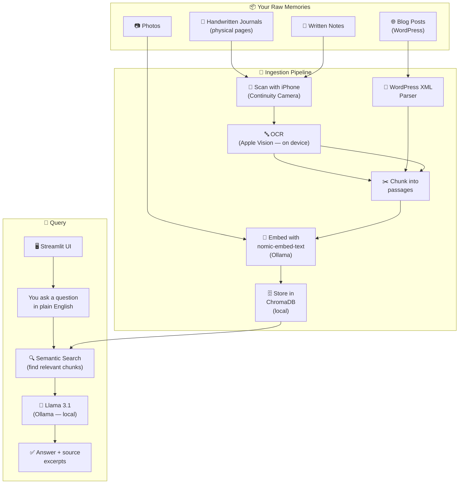

# Along the Memory Lane 📖

A fully local, private AI assistant for querying 13 years of personal journals, blogs, notes, and photos.
**Nothing leaves your machine.**

→ See [VISION.md](./VISION.md) for the story behind this project.

---

## Architecture



---

## Quick Start

### Prerequisites
- macOS (Apple Silicon M-series)
- Python 3.11+
- [Ollama](https://ollama.com)

### 1. Install Ollama and pull models
```bash
brew install ollama
ollama serve          # keep this running in background
ollama pull llama3.1
ollama pull nomic-embed-text
```

### 2. Clone and set up Python environment
```bash
git clone https://github.com/praveenkottayi/along-the-memory-lane.git
cd along-the-memory-lane
python -m venv venv
source venv/bin/activate
pip install -r requirements.txt
```

### 3. Ingest blog data (Phase 1)
```bash
# Export from: WordPress Admin → Tools → Export → All content
# Save the .xml file to data/raw/blog/

python scripts/parse_wordpress.py --input data/raw/blog/wordpress_export.xml
python scripts/ingest.py
```

### 4. Run the app
```bash
streamlit run app/app.py
```

---

## Project Structure

```
along-the-memory-lane/
├── VISION.md                    ← Project intention (start here)
├── README.md                    ← Technical setup (you are here)
├── config.py                    ← All paths and model settings
├── requirements.txt
│
├── data/
│   ├── raw/
│   │   ├── journal/             ← Scanned journal images
│   │   ├── blog/                ← WordPress XML export
│   │   └── notes/               ← Scanned notes images
│   └── processed/               ← Parsed .txt files (auto-generated)
│
├── memory_store/                ← ChromaDB vector index (gitignored)
│
├── scripts/
│   ├── parse_wordpress.py       ← Parse WordPress XML → .txt files
│   └── ingest.py                ← Embed + store in ChromaDB
│
└── app/
    └── app.py                   ← Streamlit query UI
```

---

## Phases

| Phase | Description | Status |
|-------|-------------|--------|
| 1 | WordPress blog ingestion + RAG query | 🟡 In Progress |
| 2 | Handwritten journal OCR (Apple Vision) | ⬜ Planned |
| 3 | Image search with CLIP embeddings | ⬜ Planned |
| 4 | Timeline view + "On This Day" feature | ⬜ Planned |

---

## Privacy

- All AI models run locally via [Ollama](https://ollama.com)
- Vector database (ChromaDB) is stored on your machine
- `data/` and `memory_store/` are gitignored — never committed
- No API keys, no cloud services, no data leaves your computer
