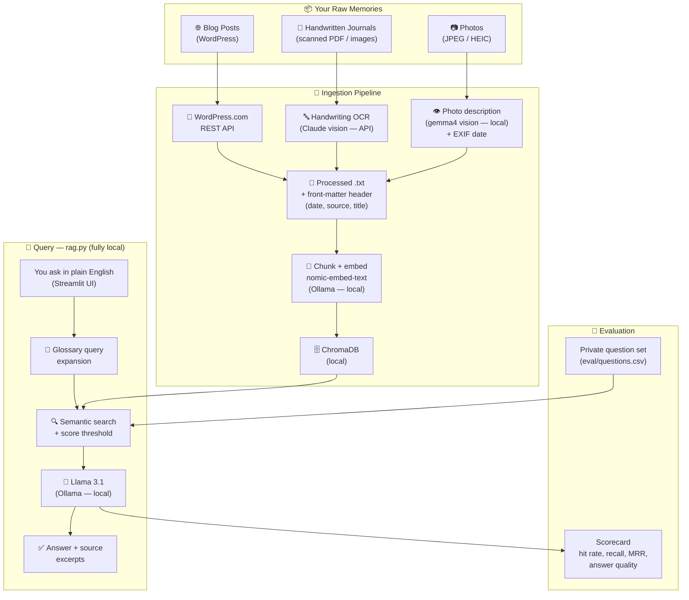

# Along the Memory Lane 📖

A fully local, private AI assistant for querying years of personal journals, blogs, and notes.
**The goal is that nothing leaves your machine.** Today one step — handwriting OCR — is
temporarily running through Claude vision while the local pipeline is being tuned; it is
slated to move to local llama3.2-vision (see [Privacy](#privacy)).

→ See [VISION.md](./VISION.md) for the story behind this project.

---

## Architecture


```mermaid
flowchart TD
    subgraph INPUT["📦 Your Raw Memories"]
        J["📓 Handwritten Journals\n(scanned PDF / images)"]
        B["🌐 Blog Posts\n(WordPress)"]
        P["📷 Photos\n(JPEG / HEIC)"]
    end

    subgraph INGEST["🔄 Ingestion Pipeline"]
        WP["📄 WordPress.com\nREST API"]
        OCR["🔤 Handwriting OCR\n(Claude vision — API)"]
        VIS["👁️ Photo description\n(gemma4 vision — local)\n+ EXIF date"]
        TXT["📑 Processed .txt\n+ front-matter header\n(date, source, title)"]
        EMBED["🧠 Chunk + embed\nnomic-embed-text\n(Ollama — local)"]
        STORE["🗄️ ChromaDB\n(local)"]
    end

    subgraph QUERY["💬 Query — rag.py (fully local)"]
        Q["You ask in plain English\n(Streamlit UI)"]
        EXP["🔁 Glossary query\nexpansion"]
        RETRIEVE["🔍 Semantic search\n+ score threshold"]
        LLM["🤖 Llama 3.1\n(Ollama — local)"]
        ANS["✅ Answer + source\nexcerpts"]
    end

    subgraph EVAL["📏 Evaluation"]
        QS["Private question set\n(eval/questions.csv)"]
        SC["Scorecard\nhit rate, recall, MRR,\nanswer quality"]
    end

    B --> WP --> TXT
    J --> OCR --> TXT
    P --> VIS --> TXT
    TXT --> EMBED --> STORE

    Q --> EXP --> RETRIEVE
    STORE --> RETRIEVE --> LLM --> ANS

    QS --> RETRIEVE
    LLM --> SC
```

---

## How It Works

Every memory — blog post, journal entry or photo — is turned into **plain text
with a small metadata header**, and from then on all sources are treated the same.

### 1. Everything becomes text

| Source | How it becomes text | Script |
|---|---|---|
| Blog | Posts fetched from the WordPress API, HTML stripped | `fetch_wordpress_api.py` |
| Handwritten journal | PDF → page images → handwriting OCR → split into **one file per dated entry** | `pdf_to_images.py`, `ocr_journals.py` or `split_journal_txt.py` |
| Photo | A **local vision model** looks at the photo and writes a 3–5 sentence description; the date comes from the photo's EXIF data (falls back to the filename, then the folder name) | `ingest_photos.py` |

Each file in `data/processed/` starts with a front-matter header:

```
---
date: 2025-10-19
source: journal          # blog | journal | photo
title: Journal — 2025-10-19
---
Body text…
```

**How photos are "read":** the image itself is never searched. `ingest_photos.py`
sends each photo to the vision model in `PHOTO_VISION_MODEL` (via Ollama, on your
machine) with `PHOTO_DESCRIPTION_PROMPT`, which asks what is happening, the setting,
the mood and notable objects. That description is cached in
`data/processed/photos/<album>/descriptions/` (so re-runs skip photos already
described) and written out as a normal text entry pointing back to the image. The
app shows the original image next to the answer.

### 2. Indexing (`scripts/ingest.py`)

- Reads every `.txt` with a front-matter header. Files without one — full-journal
  transcriptions, description caches — are skipped, because indexing them would
  duplicate entries as chunks with no date.
- Splits each entry into chunks of ~512 tokens (64 overlap).
- Embeds each chunk with `nomic-embed-text` and stores it in ChromaDB; the header
  (date, source, title) is attached to every chunk so it can be filtered and shown.

### 3. Answering a question (`rag.py`)

1. **Glossary expansion** — shorthand in the question is rewritten using
   `glossary.txt` (e.g. a nickname → "nickname (relation)").
2. **Semantic search** — the question is embedded and the 2 × `top_k` closest
   chunks are fetched from ChromaDB (optionally filtered by date range / source).
3. **Score threshold** — chunks with similarity below `score_threshold` (0.4) are
   dropped; the best `top_k` (5) remaining are kept.
4. **Answer** — Llama 3.1 writes the answer from those chunks only
   (`tree_summarize`), with a system prompt telling it to say so when nothing
   relevant was found.

`rag.py` is shared by the Streamlit app and the evaluation script, so the eval
always measures exactly what the app runs.

---

## Evaluation & Tuning

Settings are tuned against a **private question set**, not by feel.

### The question set

`eval/questions.csv` (gitignored — it contains personal details) holds real
questions with their ground truth:

| Column | Meaning |
|---|---|
| `type` | lookup, date, person, place, aggregate, timeline, vague, emotion, photo, followup, unanswerable |
| `expected_source` / `expected_dates` | which entries *should* be retrieved |
| `key_facts` | short facts a correct answer must contain (`;`-separated) |
| `reference_answer` | a model answer to compare against |

Include a few **unanswerable** questions (things never written about) — the
assistant should say it doesn't know rather than invent something.

### Running it

```bash
python scripts/evaluate.py --retrieval-only --threshold 0.4 --label try04   # ~1 s, no LLM
python scripts/evaluate.py --judge --label baseline                         # full run, ~5–7 min
python scripts/evaluate.py --ids q01,q05 --label quick                      # subset
```

Each run writes `eval/results/<timestamp>_<label>/` (`results.csv`, a readable
`answers.md`, `summary.json`) and adds a line to `eval/results/history.csv` for
comparing runs.

### Metrics

| Metric | What it tells you |
|---|---|
| **Hit rate** | share of questions where at least one expected entry reached the LLM |
| **Recall** | share of all expected entries retrieved (matters for "list everything" questions) |
| **MRR** | how high the first correct entry ranks (1st = 1.0, 2nd = 0.5…) |
| **Precision** | share of retrieved chunks that are relevant (vs. noise) |
| **Hit rate before threshold** | if much higher than hit rate, the threshold is discarding good chunks |
| **Key-fact coverage** | share of key facts found in the answer (rough word overlap) |
| **Refusals** | says "I don't know" on unanswerable questions (good) vs. on answerable ones (bad) |
| **Judge correctness / faithfulness** | optional 1–5 scores from the local LLM (`--judge`): matches the reference? any invented details? |

Retrieval metrics are deterministic; judge scores from an 8B model vary by about
±1 per question between runs, so read them as a trend.

### Tuning log

| Change | Hit rate | Recall | MRR | Judge correctness | Notes |
|---|---|---|---|---|---|
| Baseline (threshold 0.5) | 0.52 | 0.42 | 0.45 | 2.6 / 5 | 14 of 32 questions retrieved nothing; hit rate *before* threshold was 0.90 |
| Threshold 0.5 → 0.4 | 0.83 | 0.68 | 0.68 | 3.7 / 5 | the threshold was the main bottleneck; answers ~2× slower (more context) |
| Skip files without front matter | **0.86** | **0.73** | **0.76** | 3.5 / 5 | removed 63 undated duplicate chunks; unanswerable questions still refused 3/3 |

Still weak: questions hinging on a **name or place** (meaning-based search misses
exact words) and **date-specific** questions (nearby entries get mixed up). Next
planned improvements: date filters parsed from the question, then hybrid
keyword + semantic search.

---

## Quick Start

### Prerequisites
- macOS (Apple Silicon) or Linux
- Python 3.11+ — [uv](https://docs.astral.sh/uv/) recommended
- [Ollama](https://ollama.com) for local embeddings + chat
- An [Anthropic API key](https://console.anthropic.com) — only needed to OCR handwritten journals

### 1. Install Ollama and pull the local models
```bash
brew install ollama
ollama serve          # keep running in the background
ollama pull llama3.1:8b-instruct-q4_0   # matches LLM_MODEL in config.py
ollama pull nomic-embed-text             # matches EMBED_MODEL in config.py
ollama pull gemma4:12b                   # matches PHOTO_VISION_MODEL — for photo descriptions
```

### 2. Set up the Python environment
```bash
git clone https://github.com/praveenkottayi/along-the-memory-lane.git
cd along-the-memory-lane
uv sync                       # or: python -m venv .venv && pip install -r requirements.txt
```

### 3. Configure secrets and your glossary
```bash
cp .env.example .env          # add ANTHROPIC_API_KEY (only used for journal OCR)
cp glossary.example.txt glossary.txt   # add your names/abbreviations
```
The glossary is the single source of truth for personal shorthand. It feeds both
the LLM system prompt and **query expansion** — so a search for "Anu" is rewritten
to "Anu (wife)" before retrieval and actually finds the right entries.

### 4. Ingest your memories

> **Already set up? Just run `python scripts/update.py`** — see [Updating your memories](#updating-your-memories).
> The steps below are what it runs, for first-time setup or running one part by hand.


**Blog (WordPress.com):**
```bash
python scripts/fetch_wordpress_api.py   # posts + images from BLOG_SITE in config.py (or --site yoursite.com)
# Alternative, from a local XML export:
# python scripts/parse_wordpress.py --input data/raw/blog/wordpress_export.xml
python scripts/ingest.py
```

**Handwritten journals** — two ways to transcribe, can be combined:
```bash
# A) Automated pipeline: PDF → page images → Claude OCR → entry .txt files
python scripts/pdf_to_images.py --pdf "data/raw/journal/16_2025-08_2026-01.pdf"
python scripts/ocr_journals.py --journal data/raw/journal/16_2025-08_2026-01
#   Flags:
#     --all               process every folder under data/raw/journal/ in one go
#     --inspect           review per-page header detection (uses cached sidecars, no API calls)
#   Each page's OCR result is cached as page_001.ocr.txt next to the image.
#   Re-running the script skips cached pages — safe to resume after interruption.

# B) Claude-chat transcript: transcribe a PDF in Claude chat (it produces a
#    ===== PAGE N | DATE | DATE_HEADER ===== format), save as
#    data/processed/journal/#<journal_name>.txt, then parse it:
python scripts/parse_claude_transcript.py        # converts all # files to entry .txt files
#   Flags:
#     --file <path>       process a single transcript file
#     --dry-run           preview what would be written without touching anything

# After using either method, patch any missing title fields:
python scripts/migrate_add_title.py              # safe to re-run; skips files that already have title
#   Flags:
#     --dry-run           preview which files would be patched

# Add only newly written entries to ChromaDB (safe to run repeatedly):
python scripts/ingest.py --incremental
```

**Photos:**
```bash
# Drop a folder of photos (JPEG or HEIC) under data/raw/photos/<album-name>/
# e.g. data/raw/photos/2015-goa/

python scripts/ingest_photos.py --album data/raw/photos/2015-goa
#   Flags:
#     --all               process every album folder under data/raw/photos/
#     --inspect           print cached descriptions without calling the vision model
#     --dry-run           preview dates and cache status, no model calls, no writes
#   Each description is cached in data/processed/photos/<album>/descriptions/.
#   Re-running skips already-described photos. HEIC (iPhone) and JPEG both supported.

python scripts/ingest.py --incremental   # add photo descriptions to ChromaDB
```

**Rebuilding ChromaDB from scratch** (only needed after changing `EMBED_MODEL`,
`CHUNK_SIZE` or `CHUNK_OVERLAP` — for new or edited content, `--incremental` is enough):
```bash
python scripts/ingest.py          # confirm wipe when prompted → full rebuild
python scripts/ingest.py --yes    # same, without the prompt
```

### 5. Run the app
```bash
streamlit run app/app.py
```

---

## Updating Your Memories

Wrote a new blog post, transcribed a journal, or added photos? One command:

```bash
python scripts/update.py
```

| Step | What it does | Script |
|---|---|---|
| `blog` | Fetches posts newer than your latest saved one from `BLOG_SITE` (if offline, it warns and carries on) | `fetch_wordpress_api.py` |
| `journals` | Turns `#<journal>.txt` transcripts into entries, adds missing titles | `parse_claude_transcript.py`, `migrate_add_title.py` |
| `photos` | Describes **new** photos in every album with the local vision model (cached, so only new photos are processed; the first run on a big album can take 1–2 hours) | `ingest_photos.py --all` |
| `index` | Syncs ChromaDB: adds new files, **updates edited ones**, removes deleted ones | `ingest.py --incremental` |
| `eval` | ~1 s retrieval check against your question set, added to `eval/results/history.csv` | `evaluate.py --retrieval-only` |

```bash
python scripts/update.py --skip-photos          # quick update, skip the slow step
python scripts/update.py --only blog --only index   # just these steps
python scripts/update.py --full-eval            # end with the full eval (answers + judge)
```

Every step is safe to re-run: unchanged files are skipped. The index sync knows
what changed because `memory_store/ingested.json` stores a content fingerprint
(SHA-256) of every ingested file.

Not included: **handwriting OCR** (`pdf_to_images.py` + `ocr_journals.py`), which
calls the Anthropic API — run it by hand when you scan a new journal, then run
`update.py`.

---

## Hyperparameters

Model and indexing settings live in `config.py`; retrieval defaults live in `rag.py`. Every script picks them up automatically. Re-run the eval after changing any of them.

| Parameter | Where in config.py | Default | What it controls |
|-----------|-------------------|---------|-----------------|
| `EMBED_MODEL` | `EMBED_MODEL` | `nomic-embed-text` | Ollama embedding model. Must match what was used when the index was built — changing it requires a full re-ingest. |
| `LLM_MODEL` | `LLM_MODEL` | `llama3.1:8b-instruct-q4_0` | Ollama chat model used to synthesise answers. Safe to swap without re-ingesting. |
| `PHOTO_VISION_MODEL` | `PHOTO_VISION_MODEL` | `gemma4:12b` | Ollama vision model for photo descriptions. Fully local. Only called by `ingest_photos.py`. |
| `PHOTO_DESCRIPTION_PROMPT` | `PHOTO_DESCRIPTION_PROMPT` | *(see config.py)* | Prompt sent to the vision model for each photo. Edit to change what the description focuses on. |
| `OCR_VISION_MODEL` | `OCR_VISION_MODEL` | `claude-opus-4-8` | Claude model used for handwriting OCR. Only called by `ocr_journals.py`. |
| `CHUNK_SIZE` | `CHUNK_SIZE` | `512` | Tokens per chunk when splitting documents before embedding. Larger = more context per result but lower precision. Journal entries are narrative — try 768–1024. |
| `CHUNK_OVERLAP` | `CHUNK_OVERLAP` | `64` | Token overlap between consecutive chunks. Prevents a sentence being cut mid-thought at a boundary. ~10–15% of chunk size is a good rule of thumb. |
| `CHROMA_COLLECTION` | `CHROMA_COLLECTION` | `memories` | ChromaDB collection name. Change only if you want parallel indexes for testing. |
| `score_threshold` | `rag.py` `DEFAULT_SCORE_THRESHOLD` (UI slider) | `0.4` | Minimum similarity score for a chunk to be sent to the LLM. Higher = stricter. 0.5 discarded too many good chunks (see [Tuning log](#tuning-log)). |
| `top_k` | `rag.py` `DEFAULT_TOP_K` (UI slider) | `5` | How many chunks (after threshold filtering) to pass to the LLM. More = richer context, slower response. |

> **Note on chunk_size / chunk_overlap:** changing these requires wiping and rebuilding ChromaDB (`python scripts/ingest.py` → confirm wipe). The embedding and chunking happen together at ingest time.

---

## Project Structure

```
along-the-memory-lane/
├── VISION.md                   ← Project intention (start here)
├── README.md                   ← Technical setup (you are here)
├── config.py                   ← All paths, models, prompt + glossary loading
├── rag.py                      ← Retrieval + answer pipeline (shared by app and eval)
├── pyproject.toml / uv.lock    ← Dependencies (requirements.txt mirrors these)
├── .env.example                ← Template for ANTHROPIC_API_KEY
├── glossary.example.txt        ← Template for personal names/abbreviations
│
├── data/                       ← gitignored — your personal content
│   ├── raw/journal|blog|notes/ ← scanned PDFs/images, WordPress export
│   └── processed/              ← parsed .txt files with metadata headers
│
├── memory_store/               ← ChromaDB vector index (gitignored)
│
├── eval/                       ← gitignored — private question set + run results
│   ├── questions.csv
│   └── results/                ← one folder per run + history.csv
│
├── scripts/
│   ├── common.py                    ← shared helpers: front-matter r/w, journal text parsers, slug/HTML utils
│   ├── fetch_wordpress_api.py       ← fetch posts + images from a live WordPress.com site
│   ├── parse_wordpress.py           ← alternative: parse a local WordPress XML export
│   ├── pdf_to_images.py             ← scanned journal PDF → page images
│   ├── ocr_journals.py              ← Claude-vision OCR of journal images → entry .txt files
│   │                                   (--all, --inspect, page-level caching via .ocr.txt sidecars)
│   ├── parse_claude_transcript.py   ← parse Claude-chat transcripts (#journal.txt) → entry .txt files
│   │                                   (--file, --dry-run)
│   ├── migrate_add_title.py         ← one-time: stamp title into journal .txt files missing it
│   │                                   (--dry-run); safe to re-run
│   ├── split_journal_txt.py         ← split a full-journal transcription into one file per entry
│   ├── ingest_photos.py             ← Phase 3: EXIF date + local vision description → .txt
│   │                                   (--album, --all, --inspect, --dry-run; HEIC + JPEG)
│   ├── update.py                    ← one command: blog → journals → photos → index → eval check
│   ├── ingest.py                    ← chunk + embed + store in ChromaDB
│   │                                   (--incremental syncs new/changed/deleted; --yes; skips files without front matter)
│   └── evaluate.py                  ← score the pipeline on eval/questions.csv
│                                       (--retrieval-only, --judge, --ids, --label)
│
└── app/
    └── app.py                  ← Streamlit query UI
```

---

## Phases

| Phase | Description | Status |
|-------|-------------|--------|
| 1 | WordPress blog ingestion + local RAG query UI | ✅ Complete |
| 2 | Handwritten journal OCR (PDF → Claude vision → entries) | ✅ Complete (local OCR deferred) |
| 3 | Photo search — local vision descriptions → ChromaDB (same pipeline as journals) | 🚧 In progress |
| 4 | "On This Day" feature + timeline browser | ⬜ Planned |
| — | RAG evaluation harness + tuning (`langgraph` branch) | ✅ Baseline done |

---

## Privacy

The goal is uncompromising: **nothing leaves your machine.**

**Fully local today — never leaves your machine:**
- Text embeddings and chat (Ollama: `nomic-embed-text` + `llama3.1`)
- Photo descriptions (Ollama vision model — photos never leave your machine)
- The evaluation question set and results in `eval/`
- The ChromaDB vector index in `memory_store/`
- Every query, retrieval, and generated answer
- `data/`, `memory_store/`, `eval/`, `.env`, and `glossary.txt` are gitignored

**Temporary exception — handwriting OCR:**
Local vision models tried so far (Apple Vision, llava, moondream, Tesseract,
llama3.2-vision) couldn't reliably read cursive, so while the RAG side is being
trialled, journal page **images** are transcribed via the Claude API. This is a
stopgap, not the destination — the plan is to move OCR back to local
llama3.2-vision once it reads the handwriting well. Even now it runs only when you
OCR journals, sends images only (never the index or your queries), and is skipped
entirely if you ingest only typed sources (blogs, notes).
