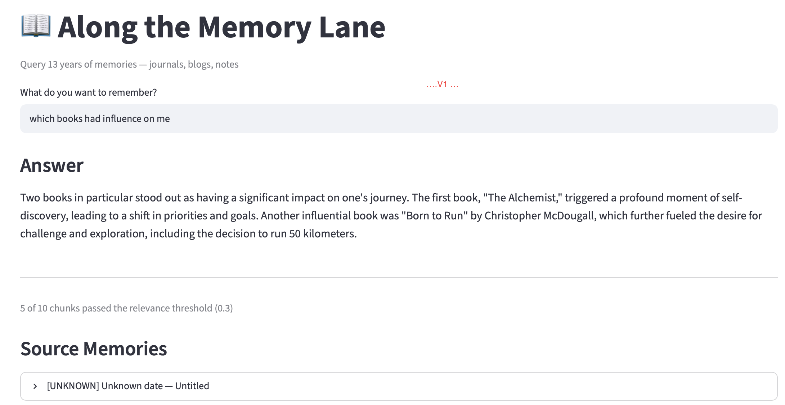

# Along the Memory Lane — Project Vision


---

## What is this?

Imagine you kept a diary every day for 13 years. You wrote about your travels, your relationships, your highs and lows, your dreams, and your ordinary Tuesday afternoons. You also wrote blog posts, jotted quick notes, and took thousands of photos.

Now imagine being able to sit down and ask:

- *"What do write most about ?"*
- *"How my thinking changed over time ?"*
- *"Where all I travelled in 2016?"*
- *"............................."*

And getting a thoughtful, accurate answer — drawn from your own words, your own memories.

That is **Along the Memory Lane**.

---

## The Problem

Personal memories are scattered:
- Handwritten journals sitting in a shelf, unread
- Blog posts buried in a WordPress archive
- Loose notes in notebooks
- Photos with no context

You *know* the memories exist. But finding them is nearly impossible. You'd have to physically flip through journals, scroll through years of blog posts, or hope your memory serves you well.

---

## The Solution

This project builds a **personal AI memory assistant** that:

1. **Ingests** all your memories — journals (via OCR), blog posts, notes, and photos
2. **Understands** the content using AI, not just keyword matching
3. **Lets you query** in plain English, by date, by event, by emotion, by person
4. **Runs entirely on your own computer** — your most private thoughts never leave your machine

Think of it as a search engine for your life, powered by AI, that only you can access.

---

## Why fully local / private?

Journals contain your rawest, most honest thoughts. They are not for the cloud. The
promise of this project is that **nothing leaves your machine**:
- **Ollama** — runs the embedding and chat models locally on your Mac
- **ChromaDB** — stores your memory index on your hard drive
- Every query, retrieval, and answer happens offline

**The one remaining gap (temporary):** transcribing *handwritten* pages. Every local
vision model tried so far (Apple Vision, llava, moondream, Tesseract, llama3.2-vision)
failed on cursive, so for now — while the RAG side is being trialled — journal images
are OCR'd through the Claude API. This is a stopgap, not the design: the intent is to
move OCR back onto local llama3.2-vision once it reads the handwriting well, closing the
loop so the system is fully offline again. Typed sources (blogs, notes) already never
touch the cloud.

---

## What data goes in?

| Source | Format | Status |
|--------|--------|--------|
| Blog posts | Fetched via WordPress.com REST API (posts + images) | ✅ Done |
| Personal journals (13 years) | Handwritten → scan → Claude-vision OCR | ✅ Done (journal #16 ingested; local OCR deferred) |
| Written notes | Handwritten → scan → Claude-vision OCR | 🚧 Phase 2 |
| Photos | JPEG/PNG with date metadata | Phase 3 |

---

## How it works (plain English)

```
Your memories (journals, blogs, notes)
        ↓
   Scan / Export
        ↓
   Convert to text (OCR for handwriting)
        ↓
   Break into chunks + understand meaning (AI embeddings)
        ↓
   Store in a local search index (ChromaDB)
        ↓
   You ask a question in plain English
        ↓
   AI finds the most relevant memories
        ↓
   AI reads them and gives you a meaningful answer
        ↓
   You also see the original source excerpts
```

---

## Roadmap

### Phase 1 — Blogs ✅ Complete
- [x] Project scaffolding and configuration
- [x] WordPress.com API fetcher (posts + images downloaded)
- [x] Text cleaning, chunking, embedding pipeline
- [x] ChromaDB vector store (local, persistent)
- [x] Streamlit query UI
- [x] Relevance score threshold filter (pre-LLM)
- [x] Date range and source filters
- [x] Code review, security audit, cleanup

### Phase 2 — Handwritten Journals ✅ Complete (local OCR deferred)
- [x] Scan pages (phone / scanner) → PDF, split into page images (`pdf_to_images.py`)
- [x] Handwriting OCR via Claude vision (`ocr_journals.py`) — page-level sidecar caching, resumable, `--all` batch mode
- [x] Alternative: Claude-chat transcript parser (`parse_claude_transcript.py`) for higher-quality transcriptions
- [x] Date / time / day / location extraction from handwritten headers
- [x] `--inspect` mode for tuning header detection without API calls
- [x] Front-matter metadata (date, title, source) propagated through to ChromaDB so UI filters work
- [x] Merge journal entries into the same ChromaDB index as blogs (`ingest.py --incremental`)
- [x] Consistent metadata schema across all sources (date, title, source, journal)
- [ ] **Move OCR onto local llama3.2-vision** — deferred until local vision models can read cursive reliably; Claude API remains the stopgap

### Phase 3 — Photos
- [ ] Migrate from ChromaDB to Qdrant (named vectors — text + image per record)
- [ ] Llama 3.2 Vision → generate rich text description per photo (occasion, mood, people, place)
- [ ] CLIP → generate visual embedding per photo
- [ ] Store both vectors + description in Qdrant per photo
- [ ] Link photos to journal entries by date
- [ ] Text query hits description vector, visual similarity hits CLIP vector

### Phase 4 — Polish
- [ ] "On this day" feature — what were you doing exactly N years ago?
- [ ] Timeline browser by year and month
- [ ] Export memory summaries as PDFs

---

## What I'm learning through this project

- **RAG (Retrieval-Augmented Generation)** — the technique of combining a search index with a language model to answer questions grounded in specific documents
- **Local LLMs** — running powerful AI models entirely on personal hardware
- **Vector embeddings** — how AI represents meaning mathematically to enable semantic search
- **OCR** — converting handwriting to machine-readable text
- **Multimodal AI** — combining text and image understanding

---

## Tech stack at a glance

| What | Tool |
|------|------|
| Query LLM | Llama 3.1 (via Ollama, local) |
| Handwriting OCR | llama3.2-vision (local) — *goal*; Claude vision (API) as a temporary trial |
| Text embeddings | nomic-embed-text (via Ollama, local) |
| Image embeddings (Phase 3) | CLIP (visual similarity) |
| Vector store | ChromaDB → Qdrant (Phase 3) |
| RAG framework | LlamaIndex |
| Scanning | Any phone camera / scanner → PDF |
| UI | Streamlit |
| Language | Python |

---

*This is a personal project. The data is private. The memories are mine.*
